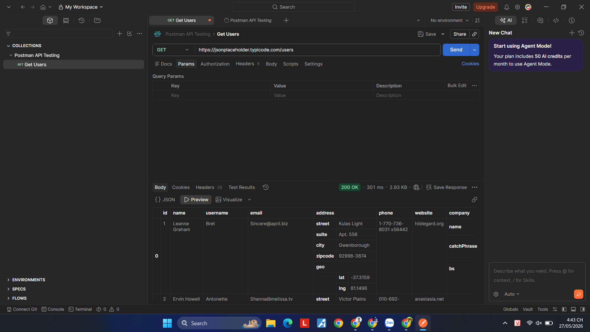
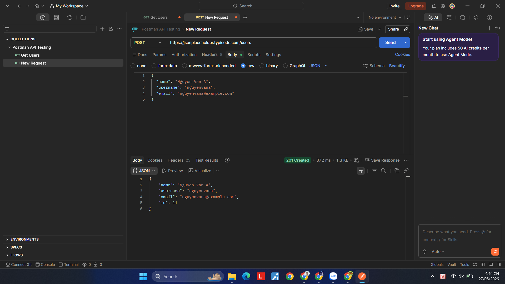
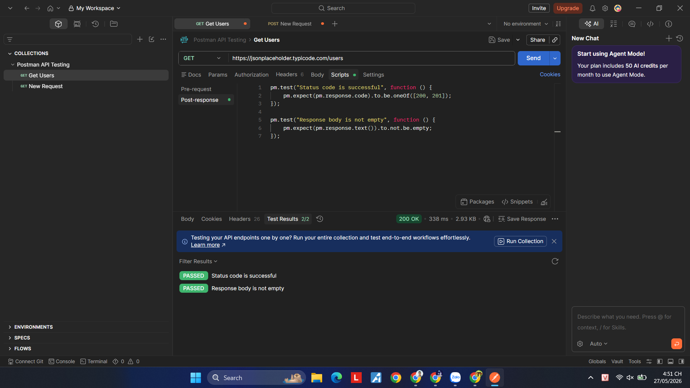
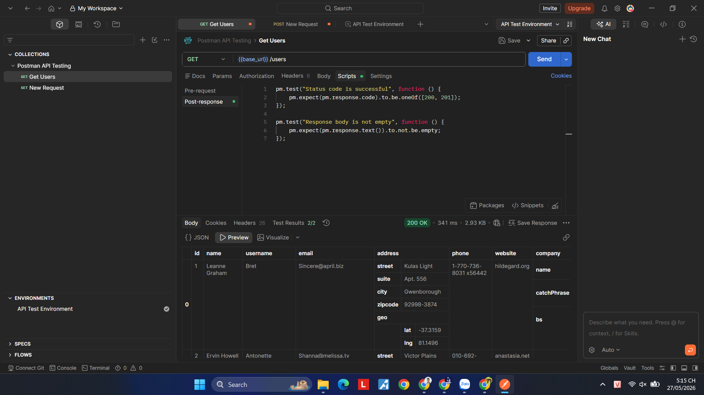
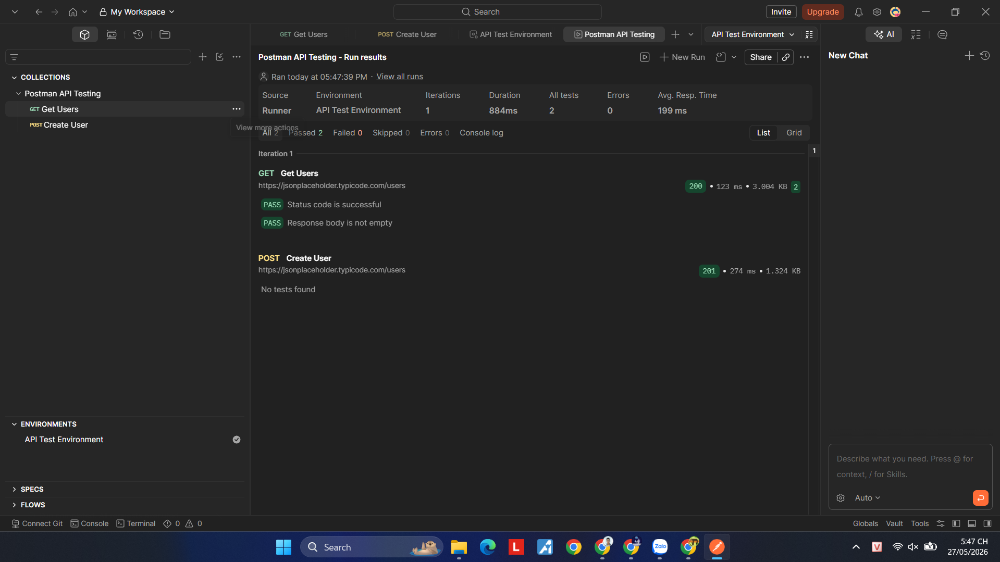

# Báo cáo thực hành kiểm thử API bằng Postman

## 1. Giới thiệu

Bài thực hành này nhằm tìm hiểu và sử dụng công cụ Postman trong kiểm thử API.  
Postman hỗ trợ gửi request HTTP, kiểm tra response, viết test script tự động, quản lý biến môi trường và chạy Collection Runner.

---

## 2. Công cụ sử dụng

- Postman
- GitHub
- API test: JSONPlaceholder

---

## 3. Tạo Collection trong Postman

Em đã tạo Collection để quản lý các request API kiểm thử.

### Minh họa



---

## 4. Thực hiện request GET

### API

```http
GET https://jsonplaceholder.typicode.com/users
```

### Mục đích

Lấy danh sách người dùng từ server.

### Kết quả

- Status: `200 OK`
- Response trả về dữ liệu JSON.

### Minh họa


---

## 5. Thực hiện request POST

### API

```http
POST https://jsonplaceholder.typicode.com/users
```

### Body JSON

```json
{
  "name": "Nguyen Van A",
  "username": "nguyenvana",
  "email": "nguyenvana@example.com"
}
```

### Kết quả

- Status: `201 Created`
- Server trả về dữ liệu người dùng vừa tạo.

### Minh họa



---

## 6. Viết Test Script trong Postman

### Test Script

```javascript
pm.test("Status code is successful", function () {
    pm.expect(pm.response.code).to.be.oneOf([200, 201]);
});

pm.test("Response body is not empty", function () {
    pm.expect(pm.response.text()).to.not.be.empty;
});
```

### Kết quả

- Các test đều PASS thành công.

### Minh họa



---

## 7. Sử dụng Environment Variable

### Variable

```text
base_url = https://jsonplaceholder.typicode.com
```

### Sử dụng

```text
{{base_url}}/users
```

### Minh họa



---

## 8. Chạy Collection Runner

Em sử dụng Collection Runner để chạy toàn bộ request tự động.

### Kết quả

- Các request chạy thành công.
- Các test đều PASS.

### Minh họa



---

## 9. Export Collection

Collection đã được export dưới dạng:

```text
postman_collection.json
```

File được lưu trong thư mục:

```text
postman/
```

---

## 10. Kết luận

Sau khi thực hiện bài thực hành, em đã:

- Biết cách sử dụng Postman để kiểm thử API.
- Biết gửi request GET và POST.
- Biết viết test script.
- Biết sử dụng Environment Variable.
- Biết chạy Collection Runner.
- Biết export Collection để chia sẻ và sử dụng lại.

Qua bài thực hành này, em hiểu rõ hơn về kiểm thử API và quy trình kiểm thử phần mềm bằng Postman.
